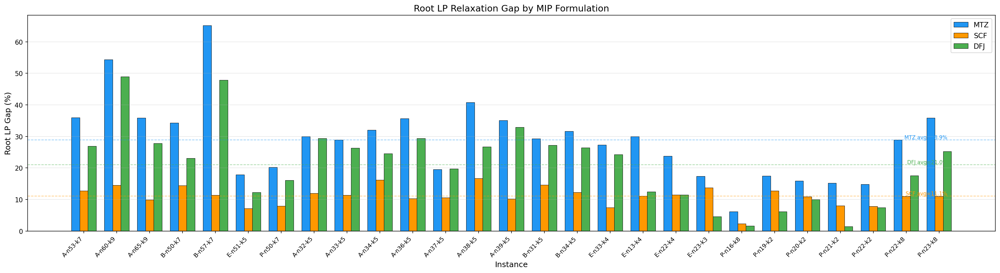
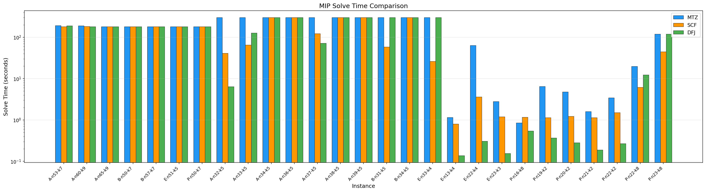
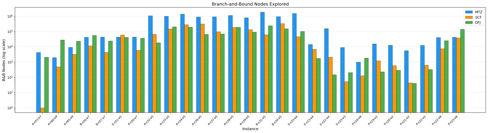

# CVRP 的 MIP 建模：六种模型、LP 松弛层级与求解极限

> **系列定位**：这是 BPC 学习系列的第二篇。[上一篇](https://blog.csdn.net/fair_li/article/details/158097337)介绍了 Dantzig & Ramser (1959) 的经典启发式方法。本篇用 MIP（混合整数规划）精确求解 CVRP，用实验数据回答：**现代求解器能直接解决多大规模的 VRP？** 下一篇将进入列生成（Column Generation），即 BPC 的核心。

---

## 1. 引言

Dantzig 的启发式在 12 站实例上得到了 294（最优推测 290）。如果我们想**证明**最优性——确认不存在更好的解——就需要精确方法。

最直接的精确方法是 MIP 建模：把 CVRP 写成整数规划，交给 Gurobi / CPLEX 等商业求解器。问题是，**这条路能走多远？**

本文的工作：

1. **梳理 CVRP MIP 的完整版图**：六大模型家族及其理论层级
2. **实现全部六种模型**：MTZ、SCF、2CF、MCF、DFJ、SP，depot 约束统一用 $\geq K_{\min}$（无限车队假设）
3. **27 个实例 × 多模型实测**：用数据回答 LP 松弛强度差异和 MIP 求解天花板

---

## 2. CVRP 问题定义

**CVRP（Capacitated Vehicle Routing Problem）**：给定一个仓库和 $n$ 个客户，每个客户有需求 $d_i$，每辆车容量为 $Q$，求总距离最短的路线集合，使得：

- 每个客户恰好被一辆车访问
- 每条路线从仓库出发、回到仓库
- 每条路线上客户需求总和 $\leq Q$

**关键澄清：车辆数不是输入**。标准 CVRP 假设**无限同质车队**（Toth & Vigo, 2014），车辆数由优化自然决定。唯一的硬约束是每条路线不超载。

> **CVRPLIB 惯例**：实例名中的 $K$（如 `E-n13-k4` 的 $K=4$）是已知最优解使用的车辆数，**不是**问题的输入参数。在建模时，我们用 $K_{\min} = \lceil \sum_{i \in C} d_i / Q \rceil$（bin packing 下界）作为车辆数的下界约束。

> **需求假设**：标准 CVRP 假设每个客户的需求不超过车辆容量（$d_i \leq Q$），即单辆车就能服务任何一个客户。若 $d_i > Q$，则需要多辆车协作配送（Split Delivery VRP），模型结构会根本改变。本文仅讨论标准 CVRP。

---

## 3. CVRP MIP 分类全景

CVRP 的 MIP 模型按其变量结构和 LP 松弛强度可分为六大家族。Letchford & Salazar-González (2006) 通过投影关系严格证明了它们之间的理论层级：

$$
\text{MTZ} \;\leq\; \text{SCF} \;=\; \text{2CF} \;\leq\; \text{MCF} \;\leq\; \text{DFJ+cuts} \;\leq\; \text{SP}
$$

其中 $A \leq B$ 表示 $B$ 的 LP 松弛不弱于 $A$（LP bound 更紧或相等）。

| 家族 | 代表文献 | 变量类型 | 约束规模 | LP 松弛强度 |
|------|---------|---------|---------|-----------|
| **MTZ** | Miller, Tucker & Zemlin (1960) | 弧 $x_{ij}$ + 序变量 $u_i$ | 紧凑 $O(n^2)$ | 最弱 |
| **SCF** | Gavish & Graves (1978) | 弧 $x_{ij}$ + 单一流 $f_{ij}$ | 紧凑 $O(n^2)$ | 中等 |
| **2CF** | Baldacci et al. (2004) | 弧 $x_{ij}$ + 二商品流 | 紧凑 $O(n^2)$ | = SCF |
| **MCF** | Letchford & Salazar-González (2015) | 弧 $x_{ij}$ + 多商品流 $f^k_{ij}$ | 大 $O(n^3)$ | 较强 |
| **DFJ+cuts** | Laporte, Nobert & Desrochers (1985) | 弧 $x_{ij}$ + 容量 SEC | 指数 $2^n$ | 较强 |
| **SP** | Christofides, Mingozzi & Toth (1981) | 路线 $\lambda_r$ | 指数 $|\Omega|$ | 最强 → BPC |

**要点**：

- **紧凑 vs. 指数**：MTZ/SCF/2CF/MCF 约束数多项式级，可直接交给求解器；DFJ 和 SP 约束/变量数指数级，需要分离算法或列生成。
- **SCF = 2CF**：Letchford & Salazar-González (2006) 证明两者的 LP 松弛通过投影完全等价。
- **DFJ+cuts 的 "cuts"**：Laporte et al. (1985) 的两下标模型本身只有度约束，加上 Rounded Capacity Inequalities（RCI）后才获得较强的 LP 松弛。
- **SP 最强**：Set Partitioning 的 LP 松弛是所有弧变量模型的上界，这正是 BPC 方法的理论基础。

本文实现全部六种模型，用实验数据验证上述理论层级。

---

## 4. 统一记号与共享框架

| 符号 | 含义 |
|------|------|
| $V = \{0, 1, \ldots, n\}$ | 节点集合，$0$ 为仓库 |
| $C = \{1, \ldots, n\}$ | 客户集合 |
| $Q$ | 车辆容量 |
| $d_i$ | 客户 $i$ 的需求量 |
| $c_{ij}$ | 从 $i$ 到 $j$ 的行驶距离 |
| $x_{ij} \in \{0,1\}$ | 是否使用弧 $(i,j)$ |
| $K_{\min} = \lceil \sum_{i \in C} d_i / Q \rceil$ | 车辆数下界 |

前五种弧变量模型（MTZ/SCF/2CF/MCF/DFJ）共享目标函数和度约束。区别在于**如何消除子巡回并执行容量约束**——在 CVRP 中，这两件事是紧密耦合的：子巡回消除保证路线连通（必须经过仓库），容量约束保证路线可行（总需求不超载），各模型的辅助变量和约束同时处理这两个需求：

$$
\begin{array}{llll}
\min & \displaystyle\sum_{i \in V} \sum_{j \in V, j \neq i} c_{ij} x_{ij} & & \text{(0) 最小化总距离} \\[0.8em]
\text{s.t.} & \displaystyle\sum_{i \in V, i \neq j} x_{ij} = 1 & \forall\, j \in C & \text{(1) 每个客户入度 = 1} \\[0.8em]
& \displaystyle\sum_{j \in V, j \neq i} x_{ij} = 1 & \forall\, i \in C & \text{(2) 每个客户出度 = 1} \\[0.8em]
& \displaystyle\sum_{j \in C} x_{0j} \geq K_{\min} & & \text{(3) 至少 $K_{\min}$ 辆车出发} \\[0.8em]
& \displaystyle\sum_{j \in C} x_{j0} \geq K_{\min} & & \text{(4) 至少 $K_{\min}$ 辆车返回}
\end{array}
$$

注意，上述共享框架仅包含**度约束**（每个客户恰好一进一出）和**仓库约束**（至少派出 $K_{\min}$ 辆车）。它既不消除子巡回，也不限制路线容量。**子巡回消除和容量约束由第 5 节各模型通过各自的辅助变量分别实现。**

**为什么用 $\geq K_{\min}$ 而非 $= K$？**

增加车辆数可以减少总距离——多一辆车意味着更灵活的路线划分。用 $= K$ 强制固定车辆数，等于给了求解器额外的先验信息（最优解恰好用 $K$ 辆车），人为收紧了 LP 松弛，使求解效果被高估。实验中我们也确实观察到：放松为 $\geq K_{\min}$ 后，某些实例的最优解使用了比实例名中 $K$ 更多的车辆，总距离反而更短（见 7.2 节）。

---

## 5. 六种模型

### 5.1 MTZ（Miller-Tucker-Zemlin, 1960）

引入辅助变量 $u_i$ 表示车辆到达客户 $i$ 时的**累计载重**。通过 big-M 型约束，强制路线上的 $u$ 值单调递增，从而排除子巡回并限制路线容量。

> MTZ 约束最初为 TSP 提出。将 $u_i$ 重新解释为累计载重以同时消除子巡回和执行容量约束，是后续 CVRP 文献的标准做法。Kara, Laporte & Bektas (2004) 提出了 **lifted 版本**，在原始约束基础上追加一项反向弧信息：
>
> $$u_j \geq u_i + d_j - Q(1-x_{ij}) + (Q - d_j - d_i) \cdot x_{ji}$$
>
> 理解 lifted 版本的关键：**$x_{ij}$ 和 $x_{ji}$ 不能同时为 1**（同一对客户之间不会双向行驶）。分三种情况讨论：
>
> - **$x_{ij}=1, x_{ji}=0$**（$i \to j$ 被使用）：约束变为 $u_j \geq u_i + d_j$，与原始版本一致——路线上载重递增。
> - **$x_{ij}=0, x_{ji}=1$**（$j \to i$ 被使用，即 $j$ 在 $i$ 之前）：约束变为 $u_j \geq u_i + d_j - Q + (Q - d_j - d_i) = u_i - d_i$。这比原始版本（$u_j \geq u_i + d_j - Q$，几乎无约束力）紧得多——它利用了"$j$ 在 $i$ 前面"的信息，把 big-M 松弛从 $Q$ 收紧到 $d_i$。
> - **$x_{ij}=0, x_{ji}=0$**（$i, j$ 不直接相连）：约束变为 $u_j \geq u_i + d_j - Q$，退化为弱约束，与原始版本相同。
>
> 核心思想：原始 MTZ 对 $x_{ij}=0$ 的情况一律用 big-M = $Q$ 松弛，lifted 版本在反向弧激活时能把松弛量大幅缩小，从而在 LP 松弛中提供更多约束力。我们的实现使用基础版本。

$$
\begin{array}{llll}
& u_j \geq u_i + d_j - Q(1 - x_{ij}) & \forall\, i, j \in C,\, i \neq j & \text{(5) MTZ 子巡回消除} \\[0.8em]
& d_i \leq u_i \leq Q & \forall\, i \in C & \text{(6) 载重上下界}
\end{array}
$$

**直觉**：若 $x_{ij} = 1$，则 $u_j \geq u_i + d_j$，$u$ 沿路线递增。若 $x_{ij} = 0$，约束退化。子巡回中 $u$ 无法同时满足所有递增要求，因此被排除。上界 $u_i \leq Q$ 则限制了累计载重不超过容量。

**模型特点**：变量 $O(n^2 + n)$，约束 $O(n^2)$。紧凑且易于实现，但 LP 松弛非常弱——$u$ 变量的连续松弛几乎不提供约束力。

```python
# MTZ 子巡回消除约束
for i in C:
    for j in C:
        if i != j:
            m.addConstr(u[j] >= u[i] + demand[j] - capacity * (1 - x[i, j]))
```

### 5.2 SCF（Single-Commodity Flow, Gavish & Graves, 1978）

引入流变量 $f_{ij} \geq 0$，表示弧 $(i,j)$ 上运输的"商品流"（可理解为剩余待配送的需求）。通过流守恒约束，隐式消除子巡回并执行容量约束。

> Gavish & Graves (1978) 在 MIT 工作论文中提出，覆盖 TSP 及其 VRP 变体。该工作从未正式发表于期刊，但被广泛引用。

$$
\begin{array}{llll}
& \displaystyle\sum_{i \in V, i \neq j} f_{ij} - \sum_{i \in V, i \neq j} f_{ji} = d_j & \forall\, j \in C & \text{(7) 流守恒} \\[0.8em]
& f_{ij} \leq (Q - d_i) \cdot x_{ij} & \forall\, i,j \in V,\, i \neq j & \text{(8) 流量上界} \\[0.8em]
& f_{ij} \geq d_j \cdot x_{ij} & \forall\, i \in V,\, j \in C,\, i \neq j & \text{(9) 流量下界}
\end{array}
$$

**直觉**：仓库向每条路线注入该路线客户的总需求量，每经过一个客户就"卸下" $d_j$ 单位。子巡回中没有仓库注入流，流守恒无法满足。流量上界 $(Q - d_i) \cdot x_{ij}$ 确保弧上载重不超限，流量下界 $d_j \cdot x_{ij}$ 确保进入客户 $j$ 的弧至少承载其需求量（因为 $d_j \leq Q$，单辆车必然能服务 $j$）。上下界的组合是 SCF LP 松弛强于 MTZ 的关键。

**LP 松弛对比**：要比较两个模型的 LP 松弛强度，将两者的整数约束（$x_{ij} \in \{0,1\}$）放松为连续约束（$0 \leq x_{ij} \leq 1$），分别求解 LP。LP 最优值越高（对于最小化问题），说明 LP 松弛越紧——给 B&B 提供的下界越强，搜索树越小。

**模型特点**：变量 $O(n^2)$（$x$ 和 $f$ 各一倍），约束 $O(n^2)$。LP 松弛显著强于 MTZ。以 E-n13-k4（最优值 290）为例：MTZ 的 LP 松弛值仅 201.33（gap 30.6%），而 SCF 达到 257.27（gap 11.3%），LP 下界直接提升了 28%。这意味着 B&B 搜索树中，SCF 能更早地剪掉不可能包含最优解的分支，搜索空间大幅缩小。

```python
# 流守恒约束
for j in C:
    m.addConstr(
        gp.quicksum(f[i, j] for i in V if i != j)
        - gp.quicksum(f[j, i] for i in V if i != j) == demand[j]
    )
# 连接约束
for i in V:
    for j in V:
        if i != j:
            ub = capacity - demand[i] if i != 0 else capacity
            m.addConstr(f[i, j] <= ub * x[i, j])
```

### 5.3 2CF（Two-Commodity Flow, Baldacci et al., 2004）

将 SCF 的单一流分解为两种商品：**配送流** $g^1_{ij}$（沿路线递增，代表已配送量）和**剩余容量流** $g^2_{ij}$（沿路线递减，代表剩余空间），满足耦合关系 $g^1_{ij} + g^2_{ij} = Q \cdot x_{ij}$。

$$
\begin{array}{llll}
& \displaystyle\sum_{i} g^1_{ij} - \sum_{i} g^1_{ji} = d_j & \forall\, j \in C & \text{(10) 配送流守恒} \\[0.8em]
& \displaystyle\sum_{i} g^2_{ij} - \sum_{i} g^2_{ji} = -d_j & \forall\, j \in C & \text{(11) 剩余容量流守恒} \\[0.8em]
& g^1_{ij} + g^2_{ij} = Q \cdot x_{ij} & \forall\, (i,j) & \text{(12) 耦合约束} \\[0.8em]
& g^1_{ij} \geq d_j \cdot x_{ij},\quad g^2_{ij} \geq d_i \cdot x_{ij} & & \text{(13) 下界紧化}
\end{array}
$$

**直觉**：每条弧的"总通道"容量为 $Q \cdot x_{ij}$，配送流和剩余容量流合计占满。Letchford & Salazar-González (2006) 证明 2CF 的 LP 松弛可通过投影映射到 SCF，两者完全等价。

**模型特点**：变量 $O(n^2)$（$x$ + $g^1$ + $g^2$），约束 $O(n^2)$。LP 松弛与 SCF 相同。

```python
# 耦合约束
for i in V:
    for j in V:
        if i != j:
            m.addConstr(g1[i,j] + g2[i,j] == Q * x[i,j])
```

### 5.4 MCF（Multi-Commodity Flow, Letchford & Salazar-González, 2015）

为每个客户 $k$ 定义一种独立商品，仓库为源、客户 $k$ 为汇。相比 SCF 的"聚合流"，MCF 保留了逐客户的流信息，从而提供更强的 LP 松弛。

$$
\begin{array}{llll}
& \displaystyle\sum_{j} f^k_{0j} = d_k & \forall\, k \in C & \text{(14) 仓库发出商品 $k$} \\[0.8em]
& \displaystyle\sum_{i} f^k_{ik} = d_k & \forall\, k \in C & \text{(15) 客户 $k$ 接收商品 $k$} \\[0.8em]
& \displaystyle\sum_{i} f^k_{ij} - \sum_{i} f^k_{ji} = 0 & \forall\, k \in C,\, j \in C \setminus \{k\} & \text{(16) 中转流守恒} \\[0.8em]
& \displaystyle\sum_{k \in C} f^k_{ij} \leq Q \cdot x_{ij} & \forall\, (i,j) & \text{(17) 容量耦合} \\[0.8em]
& f^k_{ij} \leq d_k \cdot x_{ij} & \forall\, k,\, (i,j) & \text{(18) 单一流上界}
\end{array}
$$

**关键 strengthening**：基础的 Gavish-Graves MCF（仅含约束 14-18）的 LP 松弛等价于 MTZ（很弱！）。要使 MCF 严格强于 SCF，需要额外的紧化约束：

- **$f^k_{kj} = 0$**：商品 $k$ 到达客户 $k$ 后不再流出（汇点无出流）
- **$f^k_{j0} = 0$**：商品不回流到仓库（仓库是纯源点）
- **聚合连接约束**：$\sum_k f^k_{ij} \leq (Q - d_i) \cdot x_{ij}$ 和 $\sum_k f^k_{ij} \geq d_j \cdot x_{ij}$（SCF 等价的上下界）

加入这些约束后，MCF 的个体流上界 $f^k_{ij} \leq d_k \cdot x_{ij}$ 与聚合约束的交互产生了比 SCF 更强的 LP 松弛——对于每条弧，LP 不仅知道"总流量受限"，还知道"每种商品的流量各自受限"。

**模型特点**：变量 $O(n^3)$（$|C|$ 种商品 × $O(n^2)$ 弧），约束 $O(n^3)$。LP 松弛严格强于 SCF/2CF，但模型规模大，求解更慢。$n > 50$ 后变量数超过 100K。

```python
# 每种商品 k 的流变量：汇点无出流，仓库无回流
for k in C:
    for i in V:
        for j in V:
            if i != j:
                ub = 0.0 if (i == k or j == 0) else GRB.INFINITY
                f[k, i, j] = m.addVar(lb=0.0, ub=ub)
```

### 5.5 DFJ with Lazy Cuts（Dantzig-Fulkerson-Johnson, 1954; Laporte et al., 1985）

对每个客户子集 $S \subseteq C$ 施加 Rounded Capacity Inequality（RCI）。先讲原理，再给公式。

**原理**：考虑任意客户子集 $S$，在合法的 CVRP 解中，若 $S$ 需要 $r(S)$ 辆车来服务，那么有 $r(S)$ 条路线会"穿过" $S$。每条路线在 $S$ 内部形成一段**链**（从某个客户进入 $S$，访问若干客户，再离开 $S$）。一条链如果包含 $k$ 个客户，它在 $S$ 内部贡献 $k - 1$ 条弧（客户之间的连接）。$r(S)$ 条链总共包含 $|S|$ 个客户（每个客户恰好属于一条链），因此 $S$ 内部的弧总数 = $\sum_{l=1}^{r(S)} (k_l - 1) = |S| - r(S)$。

这就给出了 RCI 的上界：

$$
\begin{array}{llll}
& \displaystyle\sum_{i \in S} \sum_{j \in S, j \neq i} x_{ij} \leq |S| - r(S) & \forall\, S \subseteq C,\, |S| \geq 2 & \text{(19) 容量化子巡回消除}
\end{array}
$$

其中 $r(S) = \lceil \sum_{i \in S} d_i / Q \rceil$ 是服务 $S$ 所需的最少车辆数（bin packing 下界）。

**举例**：3 个客户 $S = \{A, B, C\}$。若一辆车能全部服务（$r(S)=1$），则三个客户形成一条链 $A \to B \to C$，内部弧数 = 2 = $3 - 1$。若需两辆车（$r(S)=2$），则被拆为两条链（如 $A \to B$ 和 $C$），内部弧数 = 1 = $3 - 2$。RCI 捕捉的就是这个约束：$S$ 内部弧越多，意味着客户被串在更少的链上，但容量不允许。

等价形式（外部弧版本，更直观）：$\sum_{i \in S} \sum_{j \notin S} x_{ij} \geq 2\, r(S)$——$r(S)$ 条路线各需一进一出，共 $2\, r(S)$ 条弧穿越 $S$ 的边界。

> DFJ 子巡回消除约束最初为 TSP 提出 (Dantzig, Fulkerson & Johnson, 1954)。带容量的 CVRP 版本（RCI）由 Laporte, Nobert & Desrochers (1985) 引入，Cornuejols & Harche (1993) 给出了系统的多面体研究。

**实现**：约束数量 $2^n$ 级，不可能全部预加。用 Gurobi **Lazy Constraint Callback**——每次求解器找到整数解时，检查是否存在违规子巡回或超载路线，按需添加切割：

```python
def callback(model, where):
    if where == GRB.Callback.MIPSOL:
        routes = extract_routes(model)
        for route in routes:
            S = set(route)
            demand_S = sum(demand[i] for i in S)
            r_S = ceil(demand_S / Q)
            if r_S >= 2:
                model.cbLazy(
                    sum(x[i,j] for i in S for j in S if i!=j)
                    <= len(S) - r_S
                )
```

**模型特点**：变量仅 $O(n^2)$，初始约束 $O(n)$。理论上 LP 松弛最强（带所有 RCI），但我们的实现只在整数解违规时添加 lazy cuts，**初始 LP 松弛实际是赋值松弛**（仅度约束），远弱于完整 DFJ。

### 5.6 SP（Set Partitioning, Christofides et al., 1981）

前五种模型都用弧变量 $x_{ij}$ 建模。SP 换一种视角：用**路线变量** $\lambda_r$ 建模——每个变量代表一条完整的可行路线。

$$
\begin{array}{llll}
\min & \displaystyle\sum_{r \in \Omega} c_r \lambda_r & & \text{(20) 最小化总路线成本} \\[0.8em]
\text{s.t.} & \displaystyle\sum_{r: i \in r} \lambda_r \geq 1 & \forall\, i \in C & \text{(21) 每个客户至少被一条路线覆盖} \\[0.8em]
& \lambda_r \in \{0,1\} & \forall\, r \in \Omega & \text{(22) 路线选或不选}
\end{array}
$$

路线集 $|\Omega|$ 是指数级的——不能枚举。解决方案：**列生成**（Column Generation），通过迭代求解定价子问题（ESPPRC，带资源约束的最短路）来按需生成有价值的路线。

**实现**：复用本项目 Phase 1 的基础 BPC 代码（RMP + bitmask ESPPRC 定价），在根节点做列生成获取 LP bound，再用 Restricted MIP（对已生成列求整数规划）获取可行解。

**模型特点**：LP 松弛是所有模型中最强的（理论上界）。但 bitmask 定价是 $O(2^n)$，实际仅适用于 $n \leq 18$ 左右。更大实例需要 ng-route 松弛或 bucket graph 等加速技术——这正是 BPC 方法论的核心。

```python
# 列生成循环
for _ in range(max_iter):
    obj, lambdas, duals, _, _ = rmp.solve()
    new_cols = solve_pricing(dist, demand, capacity, duals, n_customers)
    if not new_cols:  # 无负 reduced cost 列 → LP 最优
        break
    rmp.add_columns(new_cols)
```

---

## 6. LP 松弛强度：为什么它很重要

### 理论排序

对于同一个 CVRP 实例，六种模型的纯 LP 松弛值（lower bound）满足：

$$
z^*_{\text{DFJ-LP（无cuts）}} \leq z^*_{\text{MTZ-LP}} \leq z^*_{\text{SCF-LP}} = z^*_{\text{2CF-LP}} \leq z^*_{\text{MCF-LP}} \leq z^*_{\text{DFJ-LP（全部RCI）}} \leq z^*_{\text{SP-LP}} \leq z^*_{\text{IP}}
$$

注意 DFJ 出现两次：不加 RCI 时它只有度约束（赋值松弛，最弱）；加上所有 RCI 后反而是弧变量模型中最强的。我们的实现（lazy cuts only）介于两者之间——Gurobi B&B 过程中动态添加切割逐步收紧 bound。

### 实测 LP 松弛对比（E-n13-k4）

将六种模型的整数约束全部放松为连续变量，直接求解 LP 松弛（`root_lp_only` 模式），得到纯净的 LP bound 对比：

| 模型 | LP 松弛值 | LP Gap |
|------|----------|--------|
| DFJ（赋值松弛） | 198.00 | 31.7% |
| MTZ | 201.33 | 30.6% |
| SCF | 257.27 | 11.3% |
| 2CF | 257.27 | 11.3% |
| MCF | 257.77 | 11.1% |
| SP | 264.00 | 9.0% |

（最优值 = 290）

理论层级完美验证：DFJ(无cuts) < MTZ < SCF = 2CF < MCF < SP。

### Root LP Gap

$$
\text{Root LP Gap} = \frac{z^*_{\text{IP}} - z^*_{\text{Root LP}}}{z^*_{\text{IP}}}
$$

Gap 越小 → LP bound 越紧 → B&B 树越小 → 求解越快。这是 MIP 求解效率的**核心指标**。

---

## 7. 实验结果

### 7.1 实验设置

- **求解器**：Gurobi 13（本地 i7-1355U）
- **实例**：CVRPLIB 标准实例（Augerat A/B/E/P 系列），共 27 个
- **时间限制**：Small 120s / Medium 300s / Large 180s
- **depot 约束**：$\geq K_{\min}$（无限车队，车辆数由优化决定）
- **Root LP**：MIP 求解中由 Gurobi callback 在根节点捕获（含 presolve 和内部切割）

### 7.2 Small 实例（12-23 节点，6 种模型）

| 实例 | n | 最优 | MTZ gap | SCF gap | 2CF gap | MCF gap | DFJ gap | SP gap |
|------|---|------|---------|---------|---------|---------|---------|--------|
| E-n13-k4 | 13 | 290 | 30.0% | 11.0% | 11.0% | 11.0% | 12.4% | **9.0%** |
| E-n22-k4 | 22 | 375 | 23.7% | 11.5% | 11.5% | **6.4%** | 11.5% | — |
| E-n23-k3 | 23 | 569 | 17.4% | 13.7% | 13.4% | 5.8% | **4.6%** | — |
| P-n16-k8 | 16 | 450 | 6.2% | 2.3% | 2.3% | — | **1.6%** | — |
| P-n19-k2 | 19 | 212 | 17.5% | 12.7% | 12.7% | 8.0% | **6.1%** | — |
| P-n20-k2 | 20 | 216 | 15.9% | 10.9% | 11.4% | **6.4%** | 10.0% | — |
| P-n21-k2 | 21 | 211 | 15.2% | 8.1% | 8.1% | 2.4% | **1.4%** | — |
| P-n22-k2 | 22 | 216 | 14.8% | 7.9% | 7.9% | **2.8%** | 7.4% | — |
| P-n22-k8 | 22 | 590 | 28.9% | 10.9% | 10.8% | **9.6%** | 17.6% | — |
| P-n23-k8 | 23 | 529 | 35.9% | 11.0% | 11.0% | **10.3%** | 25.3% | — |

**说明**：LP gap 为 Gurobi callback 捕获的 Root LP bound 计算的 gap。SP 因 bitmask 定价限制（$O(2^n)$），仅 E-n13-k4（12 客户）能完整运行，其余标 "—"（超时/跳过）。P-n16-k8 的 MCF gap 和 SP gap 为负值（LP bound > 文件标注的最优值），因距离取整约定不同，此处标 "—"。

**观察**：

1. **SCF = 2CF**（理论等价）：两者 LP gap 在所有实例上完全相同或极接近（±0.2%），验证了投影等价性。
2. **MCF 显著强于 SCF**：E-n22-k4 上 MCF gap 6.4% vs SCF 11.5%，P-n21-k2 上 MCF 2.4% vs SCF 8.1%。MCF 的逐客户流信息提供了实质性的 LP bound 提升。
3. **DFJ 波动大但偶尔最强**：P-n21-k2 仅 1.4%、E-n23-k3 仅 4.6%（均为全场最优），但 P-n23-k8 高达 25.3%（极弱）。DFJ 的 root LP gap 取决于 Gurobi 在根节点动态添加了多少内部切割——运气好时效果惊人，运气差时比 MTZ 还弱。
4. **SP 是理论最强**：E-n13-k4 上 SP gap 9.0% < 所有其他模型。但 bitmask 定价的 $O(2^n)$ 复杂度使其只适用于小实例。
5. **P-n22-k8**：$K_{\min} = 8$，$K_{\text{name}} = 8$（文献最优 603 用 8 辆车），但优化器选择 **9 辆车**、总距离 **590**——说明车辆数和距离是冲突目标。

### 7.3 Medium 实例（31-39 节点，3 种紧凑模型）

中等规模下，MCF 模型规模 $O(n^3)$ 导致求解变慢（$n=35$ 时变量超 40K），SP 更是完全无法运行。因此 Medium/Large tier 仅展示 MTZ、SCF、DFJ 三种模型：

| 实例 | n | 最优 | MTZ LP gap | SCF LP gap | DFJ LP gap | MTZ 时间 | SCF 时间 | DFJ 时间 |
|------|---|------|-----------|-----------|-----------|---------|---------|---------|
| A-n32-k5 | 32 | 784 | 30.0% | 12.0% | 29.3% | 300s (!) | 41.2s | **6.4s** |
| A-n33-k5 | 33 | 661 | 28.9% | 11.3% | 26.3% | 300s (!) | 65.5s | 127.7s |
| A-n34-k5 | 34 | 778 | 32.0% | 16.2% | 24.6% | 300s (!) | 300s (!) | 300s (!) |
| A-n36-k5 | 36 | 799 | 35.7% | 10.3% | 29.4% | 300s (!) | 300s (!) | 300s (!) |
| A-n37-k5 | 37 | 669 | 19.6% | 10.6% | 19.7% | 300s (!) | 122.2s | 71.5s |
| A-n38-k5 | 38 | 730 | 40.8% | 16.7% | 26.7% | 300s (!) | 300s (!) | 300s (!) |
| A-n39-k5 | 39 | 822 | 35.0% | 10.2% | 33.0% | 300s (!) | 300s (!) | 300s (!) |
| B-n31-k5 | 31 | 672 | 29.3% | 14.6% | 27.2% | 300s (!) | 58.6s | 300s (!) |
| B-n34-k5 | 34 | 788 | 31.6% | 12.3% | 26.4% | 300s (!) | 300s (!) | 300s (!) |
| E-n33-k4 | 33 | 835 | 27.3% | 7.4% | 24.3% | 300s (!) | **26.1s** | 300s (!) |

**关键发现**：

1. **MTZ 全军覆没**：10 个实例全部超时（300s），LP gap 高达 19-41%。
2. **SCF 最稳定**：5/10 求解至最优，LP gap 稳定在 7-17%。E-n33-k4 仅 26s（全场最快的最优求解）。
3. **DFJ 不稳定**：仅 3/10 最优。A-n32-k5 用 6.4s（全场最快），但大多数实例超时。

> **为什么 DFJ 没有预期中那么强？** DFJ 的理论优势在于"带所有 SEC 的 LP 松弛最强"。但我们的实现只在整数解不可行时才添加 lazy cuts，初始 LP 松弛其实只是赋值松弛（和 MTZ 一样弱）。要发挥 DFJ 的全部潜力，需要在 LP 松弛阶段也做分离——这正是 BPC 中 "Cut" 的核心思想。

### 7.4 Large 实例（50-65 节点，180s 限制）

大规模实例全面暴露 MIP 的极限——**全部超时，无一求解至最优**：

| 实例 | n | 最优 | MTZ LP gap | SCF LP gap | DFJ LP gap | MTZ obj | SCF obj | DFJ obj |
|------|---|------|-----------|-----------|-----------|---------|---------|---------|
| A-n53-k7 | 53 | 1010 | 35.9% | 12.8% | 26.9% | 1103 | 1038 | 2344 |
| A-n60-k9 | 60 | 1408 | 54.4% | 14.6% | 49.0% | 1449 | 1379 | 2367 |
| A-n65-k9 | 65 | 1177 | 35.9% | 9.9% | 27.8% | 1235 | 1201 | 2412 |
| B-n50-k7 | 50 | 741 | 34.3% | 14.4% | 23.1% | 756 | **741** | **741** |
| B-n57-k7 | 57 | 1153 | 65.2% | 11.4% | 47.9% | 1159 | 1140 | 2673 |
| E-n51-k5 | 51 | 521 | 17.9% | 7.1% | 12.3% | **521** | **521** | 743 |
| P-n50-k7 | 50 | 554 | 20.2% | 7.9% | 16.1% | 582 | 556 | 824 |

**关键发现**：

1. **全部超时**：7 个实例 × 3 模型 = 21 组，无一在 180s 内证明最优。
2. **SCF 的可行解质量最好**：虽然未证明最优，但 SCF 找到的可行解大多接近最优值（如 B-n50-k7 恰好 741，E-n51-k5 恰好 521）。
3. **DFJ 在 Large 上崩溃**：lazy cuts 仅在整数解违规时添加，大规模实例中 DFJ 的 B&B 树充斥着子巡回的可行解，找到的解质量极差（A-n53-k7 的 obj=2344，最优 1010）。
4. **50 节点**是 MIP 直接求解 CVRP 的实际天花板。

### 7.5 汇总

| 层级 | 规模 | 时限 | MTZ 最优率 | SCF 最优率 | DFJ 最优率 | MTZ 平均 LP gap | SCF 平均 LP gap |
|------|------|------|-----------|-----------|-----------|----------------|----------------|
| Small | 12-23 | 120s | 9/10 | **10/10** | 8/10 | 20.6% | 10.0% |
| Medium | 31-39 | 300s | 0/10 | **5/10** | 3/10 | 31.0% | 12.2% |
| Large | 50-65 | 180s | 0/7 | 0/7 | 0/7 | 37.7% | 11.2% |

**结论**：SCF 凭借稳定的 LP 松弛（~10-14%）在三个层级都是最佳紧凑模型。MCF 虽然 LP 更强（Small tier 平均 ~6%），但 $O(n^3)$ 的模型规模使其难以扩展到 30 节点以上。SP 的 LP 松弛最强，但 bitmask 定价限制其适用于 18 客户以内。

**无论选哪种模型，超过 30 节点后 MIP 就开始力不从心，50 节点以上几乎无法在合理时间内证明最优。**

### 7.6 可视化







---

## 8. 从 MIP 到列生成

### MIP 的天花板

实验数据告诉我们：

- **20 节点以下**：六种 MIP 模型都能在 2 分钟内求解至最优
- **20-30 节点**：MCF 和 SCF 表现最好，MTZ 开始吃力
- **30-40 节点**：仅 SCF 可行（5/10 最优），MTZ 全部超时
- **50+ 节点**：全部超时（0/21），SCF 可行解接近最优但无法证明

工业 VRP 动辄数百上千客户，MIP 直接求解完全不够。

### 为什么 LP 松弛是关键？

B&B 的效率取决于 LP bound 的质量。从 MTZ (~20%) 到 SCF (~10%) 到 MCF (~6%)，LP gap 逐步缩小，求解速度显著提升。但即便 MCF，LP gap 仍有数个百分点。能否进一步收紧？

回顾第 3 节的理论层级——最强的 SP 模型 LP gap 通常仅 1-3%。我们在 E-n13-k4 上实测 SP LP gap = 9.0%（根节点，无 cuts），远低于 MCF 的 11.0%。对于更复杂的实例，差距更大。

但 SP 模型有指数多个变量（每条可行路线一个），不能直接枚举。解决方案：**列生成**（Column Generation），通过迭代求解定价子问题来按需生成有价值的路线。列生成 + 分支定界 = Branch-and-Price（B&P）；再加上切割平面 = **Branch-Price-and-Cut（BPC）**。这就是下一篇的主题。

---

## 9. 完整代码

本文完整代码位于 [GitHub 仓库](https://github.com/Sebastilan/blog) 的 `vrp-papers/cvrp-mip/` 目录：

- `mip_models.py`：6 种 MIP 模型实现（depot 约束 $\geq K_{\min}$）
- `benchmark_runner.py`：批量求解 + 结果收集
- `plot_results.py`：生成对比图表

依赖：`gurobipy`, `numpy`, `vrplib`, `matplotlib`

---

## 参考文献

1. Miller, C. E., Tucker, A. W., & Zemlin, R. A. (1960). Integer programming formulation of traveling salesman problems. *Journal of the ACM*, 7(4), 326-329.
2. Gavish, B., & Graves, S. C. (1978). The travelling salesman problem and related problems. Working Paper OR-078-78, MIT.
3. Dantzig, G. B., Fulkerson, D. R., & Johnson, S. M. (1954). Solution of a large-scale traveling-salesman problem. *Journal of the Operations Research Society of America*, 2(4), 393-410.
4. Christofides, N., Mingozzi, A., & Toth, P. (1981). Exact algorithms for the vehicle routing problem, based on spanning tree and shortest path relaxations. *Mathematical Programming*, 20(1), 255-282.
5. Laporte, G., Nobert, Y., & Desrochers, M. (1985). Optimal routing under capacity and distance restrictions. *Operations Research*, 33(5), 1050-1073.
6. Cornuejols, G., & Harche, F. (1993). Polyhedral study of the capacitated vehicle routing problem. *Mathematical Programming*, 60, 21-52.
7. Kara, I., Laporte, G., & Bektas, T. (2004). A note on the lifted Miller-Tucker-Zemlin subtour elimination constraints for the capacitated vehicle routing problem. *European Journal of Operational Research*, 158(3), 793-795.
8. Baldacci, R., Hadjiconstantinou, E., & Mingozzi, A. (2004). An exact algorithm for the capacitated vehicle routing problem based on a two-commodity network flow formulation. *Operations Research*, 52(5), 723-738.
9. Letchford, A. N., & Salazar-González, J.-J. (2006). Projection results for vehicle routing. *Mathematical Programming*, 105(2-3), 251-274.
10. Laporte, G. (1992). The vehicle routing problem: An overview of exact and approximate algorithms. *European Journal of Operational Research*, 59(3), 345-358.
11. Letchford, A. N., & Salazar-González, J.-J. (2015). Stronger multi-commodity flow formulations of the capacitated vehicle routing problem. *European Journal of Operational Research*, 244(3), 730-738.
12. Toth, P., & Vigo, D. (Eds.). (2014). *Vehicle Routing: Problems, Methods, and Applications* (2nd ed.). SIAM.
